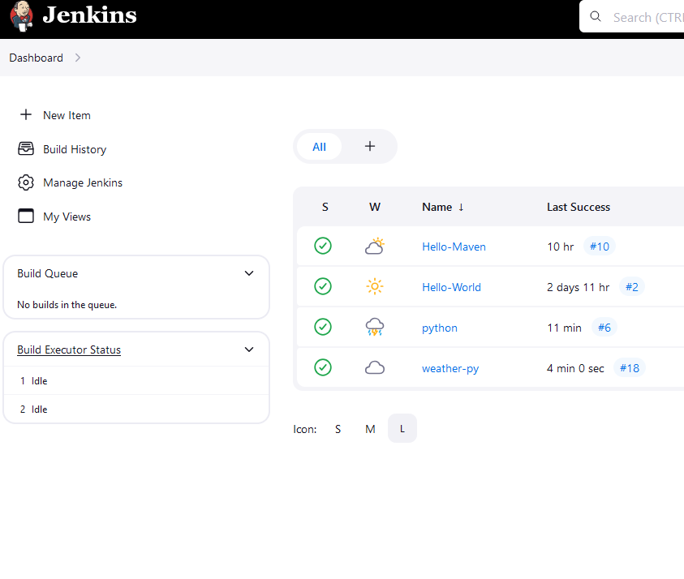
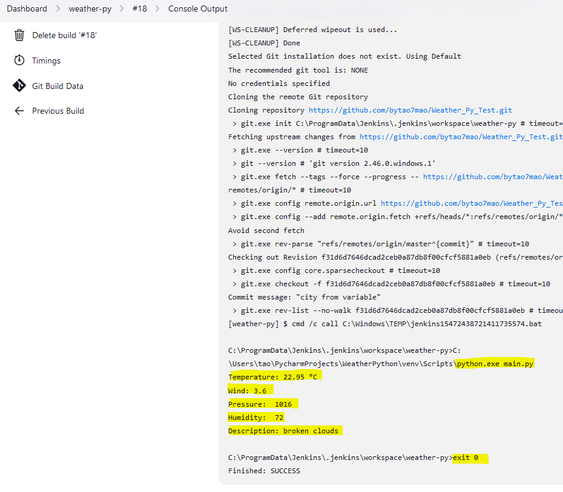

# Weather_Py_Test - gets weather data from api, connected and running with jenkins

### Mockup of retrieving Data (work in progress)

 

 

1. https://skillbuilder.aws/learn
2. https://www.awseducate.com/student/s/content

1.**VPC Routes:** private > Router points to a NAT Gateway
10.10.0.0/16 local
0.0.0.0/0 nat-0541b984cf11de1d2
How it works:
This setup is used in a private subnet.
Instances in this subnet have private IPs only (no public IPs).
When these instances send traffic to the internet:
It first goes to the NAT Gateway.
The NAT Gateway replaces their private IP with its own public IP before sending it out.
Responses from the internet go back through the NAT Gateway, which translates them back to the instance’s private IP.
✅ Use case:
Private instances that need to access the internet (e.g., to download updates or contact APIs) but should not be accessible from the internet.
✅ Security:
Inbound connections from the internet are not allowed — it’s outbound-only.
2.**VPC Routes:** public > Route points to an Internet Gateway
10.10.0.0/16 local
0.0.0.0/0 igw-0abcd12345ef6789
How it works:
This setup is used in a public subnet.
Instances in this subnet typically have public IP addresses (or Elastic IPs).
Traffic from these instances can go directly to the internet through the Internet Gateway (IGW).
Likewise, inbound traffic from the internet can reach these instances, if allowed by:
The security group rules, and
The network ACLs.
✅ Use case:
Instances that need to be publicly accessible, like web servers, load balancers, or bastion hosts.
⚠️ Security note:
Because the instance has a public IP and IGW access, it can be reached from the internet — so inbound SSH/HTTP access must be carefully controlled.

<html><body>
<!--StartFragment--><h2 data-start="1989" data-end="2013">Summary Comparison</h2>

Feature | NAT Gateway | Internet Gateway
-- | -- | --
Typical subnet | Private subnet | Public subnet
Instance IPs | Private only | Public (or Elastic) IP
Outbound internet access | ✅ Allowed | ✅ Allowed
Inbound internet access | 🚫 Not allowed | ✅ Allowed (if security group permits)
Security | Very secure (outbound only) | Must manage inbound access
Common usage | App/database servers | Web servers, bastion hosts

<!--EndFragment-->
</body>
</html>
